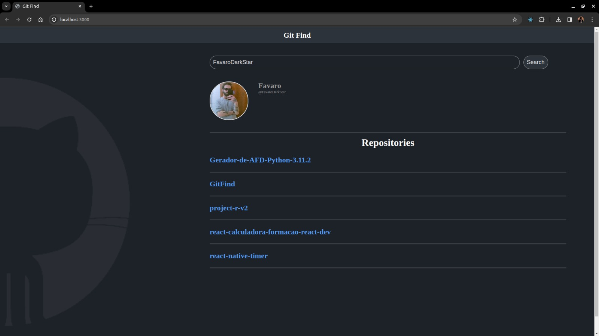

# Projeto: Git Find

Este projeto foi desenvolvido como parte do curso **Primeira Aplicação em React - Digital Innovation One**.



## Descrição
O Git Find é uma aplicação que utiliza a API do GitHub para recuperar informações de perfil com base no nome de usuário fornecido. 

## Funcionalidades
- Buscar usuário do GitHub e exibir informações como:
  - Nome, Login e Foto do usuário
  - Nome e descrição dos repositórios públicos do usuário

## Como usar

1. Clone o repositório para o seu ambiente local:

   ```bash
   git clone https://github.com/seu-usuario/git-find.git
   ```

2. Acesse o diretório do projeto:

   ```bash
   cd git-find
   ```

3. Instale as dependências necessárias:

   ```bash
   npm install
   ```

4. Execute o aplicativo:

   ```bash
   npm start
   ```

5. Abra o navegador e acesse [http://localhost:3000](http://localhost:3000) para visualizar o aplicativo em ação.

Agora você está pronto para explorar e experimentar o Git Find!
